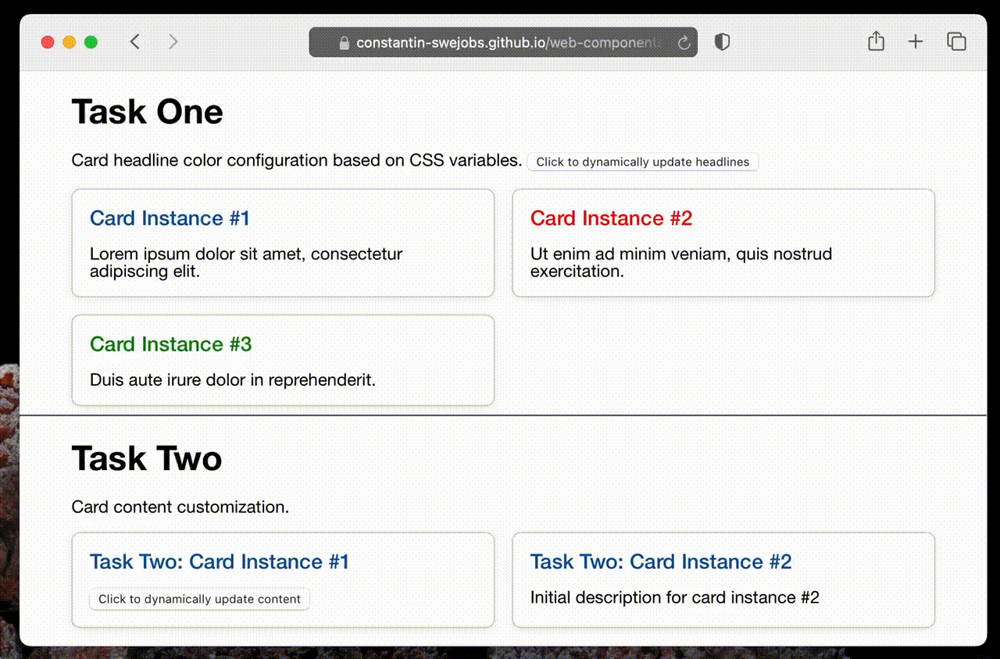

# Web Components Assignment

(Constantin Panaitescu)

[**Demo link**](https://constantin-swejobs.github.io/web-components-assignment/)

## Installation

In the project directory, run:

`npm install`
or
`yarn`

## Usage

### Building

In the project directory, run

`npm run build`
or
`yarn build`

... which will generate a static bundle in _`public/dist`_. The application can be accessed by statically serving the _`public`_ folder.

